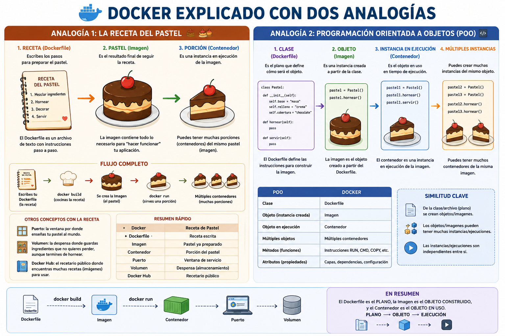
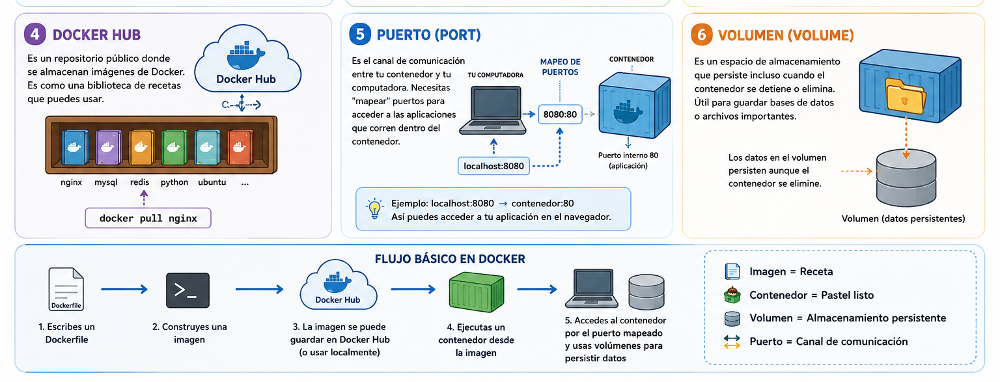
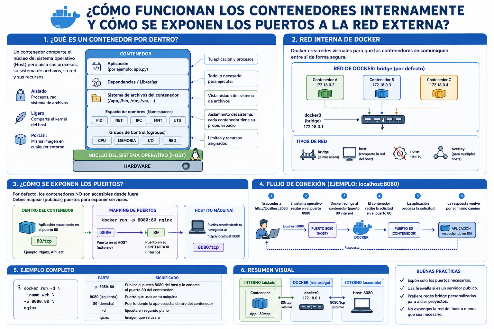

# Introducción
## ¿Qué es Docker?

Docker es una plataforma que te permite **empaquetar aplicaciones junto con todas sus dependencias** en contenedores. Imagina que quieres enviar un pastel a alguien: en lugar de enviar solo el pastel y esperar que la otra persona tenga los platos, cubiertos y servilletas correctas, Docker te permite enviar todo junto en una caja completa y lista para usar.

## Conceptos Clave

### 🔑 Palabras Técnicas Fundamentales

**Imagen (Image)**: Es como una "receta" o "plantilla" que contiene todo lo necesario para crear un contenedor. Incluye el código de tu aplicación, las bibliotecas, las herramientas del sistema, etc. Las imágenes son de solo lectura.

**Contenedor (Container)**: Es una instancia en ejecución de una imagen. Si la imagen es la receta, el contenedor es el pastel ya horneado. Puedes tener múltiples contenedores corriendo desde la misma imagen.

**Dockerfile**: Es un archivo de texto que contiene las instrucciones para construir una imagen. Es literalmente la receta escrita paso a paso.

**Docker Hub**: Es un repositorio público donde se almacenan imágenes de Docker. Es como una biblioteca de recetas que puedes usar.

**Puerto (Port)**: Es el canal de comunicación entre tu contenedor y tu computadora. Necesitas "mapear" puertos para acceder a las aplicaciones que corren dentro del contenedor.

**Volumen (Volume)**: Es un espacio de almacenamiento que persiste incluso cuando el contenedor se detiene o elimina. Útil para guardar bases de datos o archivos importantes.





## Instalación

Primero necesitas instalar Docker Desktop desde [docker.com](https://www.docker.com/). Está disponible para Windows, Mac y Linux.

Para verificar que está instalado correctamente:
```bash
docker --version
```

## Comandos Básicos

### 📦 Trabajando con Imágenes

```bash
# Descargar una imagen desde Docker Hub
docker pull nombre-imagen

# Listar todas las imágenes que tienes localmente
docker images

# Eliminar una imagen
docker rmi nombre-imagen

# Construir una imagen desde un Dockerfile
docker build -t nombre-de-tu-imagen .
```


# Guía básica de Docker con Alpine y Nginx

## 1. Descargar la imagen Alpine

```bash
docker pull alpine
```

Esto descarga la imagen oficial de Alpine Linux.

## 2. Ejecutar Alpine en modo interactivo

```bash
docker run -it alpine sh
```

Entrarás a una terminal dentro del contenedor Alpine.

## 3. Instalar Python y pip en Alpine

Dentro del contenedor ejecuta:

```bash
apk add python3 py3-pip
```

Verifica la instalación:

```bash
python3 --version
pip3 --version
```

## 4. Ver imágenes descargadas

Sal del contenedor:

```bash
exit
```

Luego revisa las imágenes:

```bash
docker images
```

## 5. Eliminar la imagen Alpine

Primero asegúrate de que no haya contenedores usando Alpine:

```bash
docker ps -a
```

Si existe un contenedor Alpine, elimínalo:

```bash
docker rm <ID_DEL_CONTENEDOR>
```

Luego elimina la imagen:

```bash
docker rmi alpine
```

## 6. Ejecutar Nginx como API Gateway

```bash
docker run -d -p 8080:80 --name my_api_gateway nginx:alpine
```

Esto crea un contenedor llamado `my_api_gateway`.

Accede desde el navegador:

```text
http://localhost:8080
```

## 7. Entrar al contenedor Nginx

```bash
docker exec -it my_api_gateway sh
```

## 8. Actualizar paquetes e instalar nano

Dentro del contenedor Nginx:

```bash
apk update
apk add nano
```

## 9. Ir al directorio web de Nginx

```bash
cd /usr/share/nginx/html
```

Ahí puedes editar el archivo principal:

```bash
nano index.html
```

## 10. Ver cambios

Guarda el archivo y abre nuevamente:

```text
http://localhost:8080
```





### Crear tu Propio "Hola Mundo"

**Paso 1**: Crea una carpeta para tu proyecto
```bash
mkdir hola-docker
cd hola-docker
```

**Paso 2**: Crea un archivo `index.html`
```html
<!DOCTYPE html>
<html>
<head>
    <title>Mi Primer Docker</title>
</head>
<body>
    <h1>¡Hola Mundo desde Docker! 🐳</h1>
    <p>Si ves esto, Docker está funcionando correctamente.</p>
</body>
</html>
```

**Paso 3**: Crea un `Dockerfile` (sin extensión)
```dockerfile
# Usar nginx como imagen base
FROM nginx:alpine

# Copiar nuestro HTML al contenedor
COPY index.html /usr/share/nginx/html/index.html

# Exponer el puerto 80
EXPOSE 80
```

**Paso 4**: Construye tu imagen (Comparado con POO la imagen es como una clase)
```bash
docker build -t mi-hola-mundo .
```

**Paso 5**: Ejecuta tu contenedor (Comparado con POO esto sería una instancia, eso quiere decir que hola-contenedor es una instancia de mi-hola.mundo)
```bash
docker run -d -p 8080:80 --name hola-contenedor mi-hola-mundo 
```

**Paso 6**: Abre tu navegador en `http://localhost:8080`

**Paso 7**: Enlazar lo que se escribre de código con lo que está escrito en el contenedor

```bash
docker run -d -p 8081:80 --name hola-contenedor -v ${PWD}:/usr/share/nginx/html mi-hola-mundo
```

También puede ser nginx con la imagen original de nginx

```bash
docker run -d -p 8081:80 --name hola-contenedor -v ${PWD}:/usr/share/nginx/html nginx
```

## Explicación del Dockerfile

- `FROM nginx:alpine`: Indica que tu imagen se basará en la imagen oficial de nginx (versión ligera alpine)
- `COPY`: Copia archivos desde tu computadora al contenedor
- `EXPOSE`: Documenta qué puerto usa la aplicación (no lo publica automáticamente)

## Flujo de Trabajo Típico

1. **Desarrollas** tu aplicación localmente
2. **Creas** un Dockerfile con las instrucciones
3. **Construyes** una imagen con `docker build`
4. **Ejecutas** un contenedor con `docker run`
5. **Pruebas** que todo funcione
6. **Publicas** tu imagen a Docker Hub (opcional)

### 🚀 Trabajando con Contenedores

```bash
# Crear y ejecutar un contenedor desde una imagen
docker run nombre-imagen

# Ejecutar un contenedor en segundo plano (modo detached)
docker run -d nombre-imagen

# Ejecutar con un nombre personalizado y mapeo de puertos
docker run -d -p 8080:80 --name mi-contenedor nombre-imagen

# Listar contenedores en ejecución
docker ps

# Listar TODOS los contenedores (incluidos los detenidos)
docker ps -a

# Detener un contenedor
docker stop nombre-contenedor

# Iniciar un contenedor detenido
docker start nombre-contenedor

# Reiniciar un contenedor
docker restart nombre-contenedor

# Eliminar un contenedor
docker rm nombre-contenedor

# Ver los logs de un contenedor
docker logs nombre-contenedor

# Entrar a un contenedor en ejecución (modo interactivo)
docker exec -it nombre-contenedor /bin/bash
```

### 🧹 Limpieza

```bash
# Eliminar todos los contenedores detenidos
docker container prune

# Eliminar todas las imágenes no utilizadas
docker image prune

# Limpieza completa (¡cuidado!)
docker system prune -a
```

## Tips para Principiantes

✅ Usa `--name` para nombrar tus contenedores, es más fácil recordarlos que los IDs aleatorios

✅ El flag `-d` ejecuta contenedores en segundo plano, dejándote libre la terminal

✅ Siempre mapea puertos con `-p puerto-local:puerto-contenedor`

✅ Usa `docker logs` cuando algo no funcione para ver qué pasó

✅ `docker exec -it` es tu amigo para explorar dentro de los contenedores

## Práctica Sugerida

1. Ejecuta el comando `hello-world`
2. Crea un servidor nginx básico
3. Construye tu propio Dockerfile con HTML personalizado
4. Experimenta deteniendo, iniciando y eliminando contenedores

¡Con esto tienes los fundamentos para empezar con Docker! 🐳
